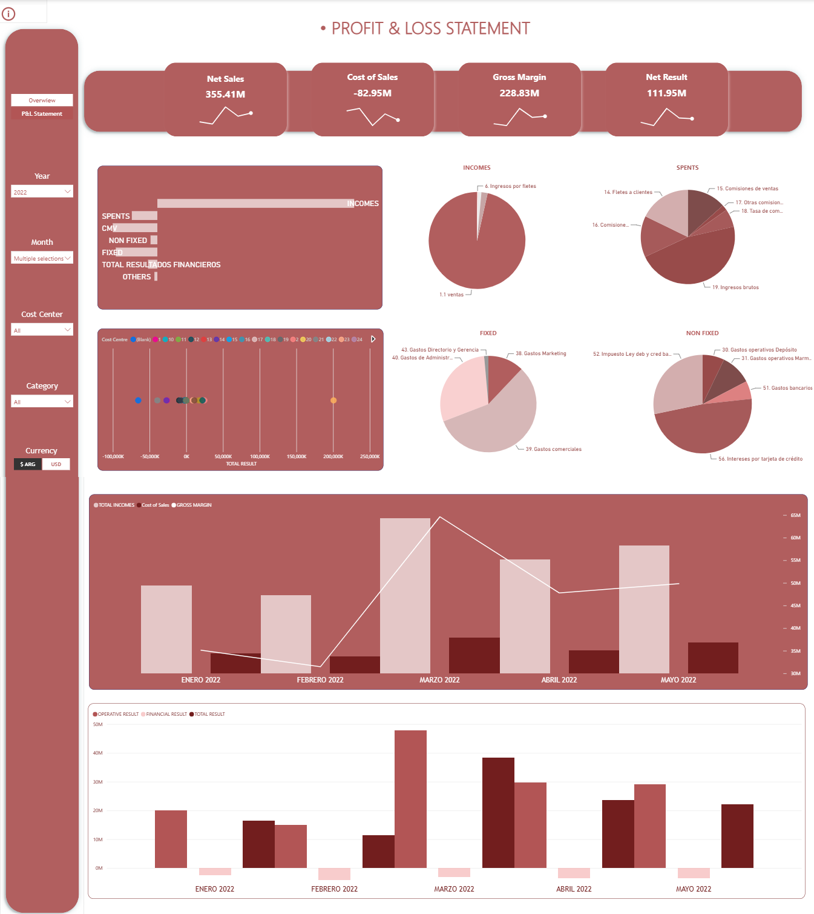
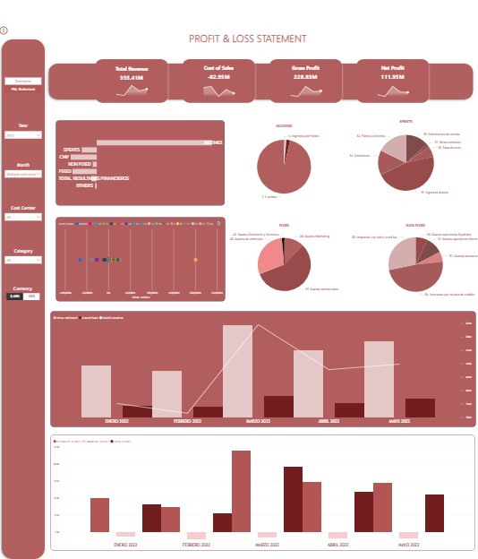

# Dynamic P&L Statement

Interactive **P&L Statement** built in **Power BI** with dynamic financial logic, including **gross vs net analysis**, **ARS/USD currency switching**, **$ / % views**, and **total vs average periods**. Designed with reusable **DAX measures**, secure data handling, and a focus on accurate **financial analysis** and business decision-making.

## Context
A construction company required a flexible P&L dashboard to analyze financial performance across different periods, currencies, and aggregation levels. The solution needed to support management analysis while maintaining strong control over data accuracy and integrity.

## Objectives
- Build a dynamic **P&L Statement**
- Enable **vertical** and **horizontal analysis**
- Allow switching between **ARS / USD**
- Allow switching between **$ / %**
- Allow **Total vs Average** of selected months
- Ensure **data integrity** (no manual modification)

## Technical Stack

**Power BI**
- Data modelling (star schema design)
- Measure-driven reporting architecture
- KPI card design and financial dashboards
- Dynamic slicer-controlled reports

**DAX**
- Context manipulation using CALCULATE
- Conditional logic with SWITCH(TRUE())
- Dynamic selection using SELECTEDVALUE
- Reusable financial measure structure

**Power Query (M)**
- Data cleaning and normalization
- Column transformations and data shaping
- Merging and appending queries
- Handling duplicate records
- Preparing structured financial datasets

**SQL (Firebird – IBExpert)**
- Custom view creation
- Aggregation and grouping logic
- Join operations across financial tables
- Preventing duplication in expense merging
- Structured extraction for BI reporting

**Financial Reporting Expertise**
- Vertical and horizontal P&L analysis
- Contribution margin structure
- Multi-currency financial reporting
- Dynamic gross vs net revenue logic

## Notes on Data
For confidentiality reasons, the PBIX file and original client data are not shared publicly.
All numeric values shown in the screenshots were modified and anonymized, and in some cases no longer reflect real business meaning, in order to fully protect sensitive financial information. The focus of this project is on modeling logic, interactivity, and analytical design, rather than on the specific figures.

## Screenshots

### Financial Analysis
This page presents a high-level view of the company's financial performance, summarizing revenue, costs, and overall results for the selected period. It allows management to quickly monitor the general financial health of the business before drilling down into the detailed P&L structure.

### P&L
This page displays the full Profit & Loss statement, structured to support both vertical analysis (each line as a percentage of revenue) and horizontal analysis (evolution across periods). It breaks down revenue, cost of goods sold, gross profit, operating expenses, and net result, giving management a detailed and traceable view of how profitability is built line by line.

 

### Dynamic Logic (Currency, Units, Averages)
This page displays the full Profit & Loss statement, structured to support both vertical analysis (each line as a percentage of revenue) and horizontal analysis (evolution across periods). It breaks down revenue, cost of goods sold, gross profit, operating expenses, and net result, giving management a detailed and traceable view of how profitability is built line by line.

## Key Insights & Recommendations
This analysis provides a clear and flexible view of the company's financial performance, supporting management decision-making across currencies, aggregation levels, and time periods.

### Key Insights
Gross and net profitability can vary significantly depending on the currency and aggregation level selected, highlighting the importance of a flexible reporting structure.
Vertical analysis reveals which cost and expense lines have the greatest impact on the final result, exposing structural cost drivers.
Horizontal analysis across periods helps identify trends and deviations in revenue and cost behavior over time.
### Business Recommendations
Use vertical analysis regularly to monitor the weight of key cost lines and detect early signs of margin erosion.
Leverage the ARS/USD and $/% toggles to align financial reporting with both local management needs and currency exposure analysis.
Extend the data model with budget or forecast data to enable variance analysis between actual and planned results.
